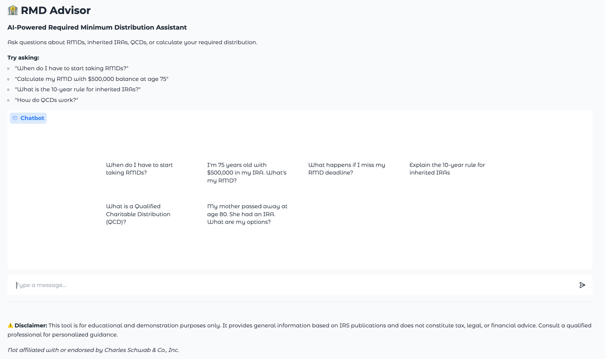
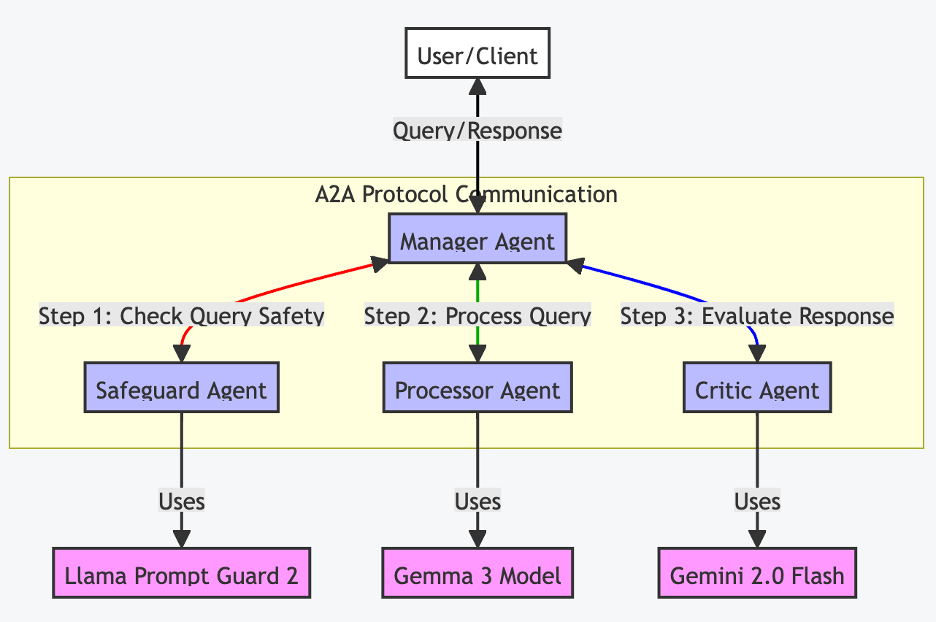
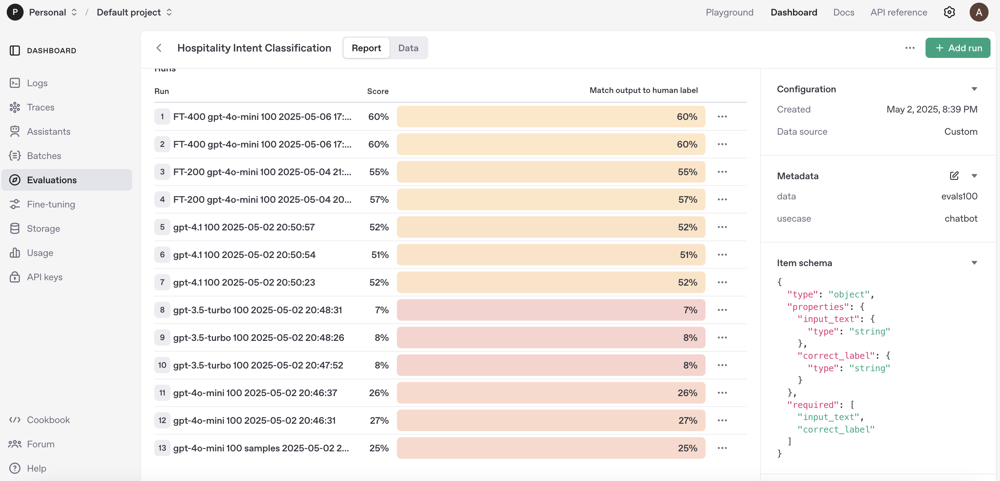
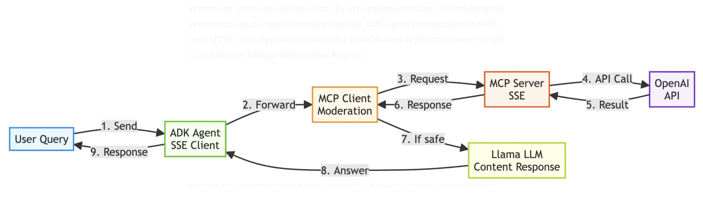
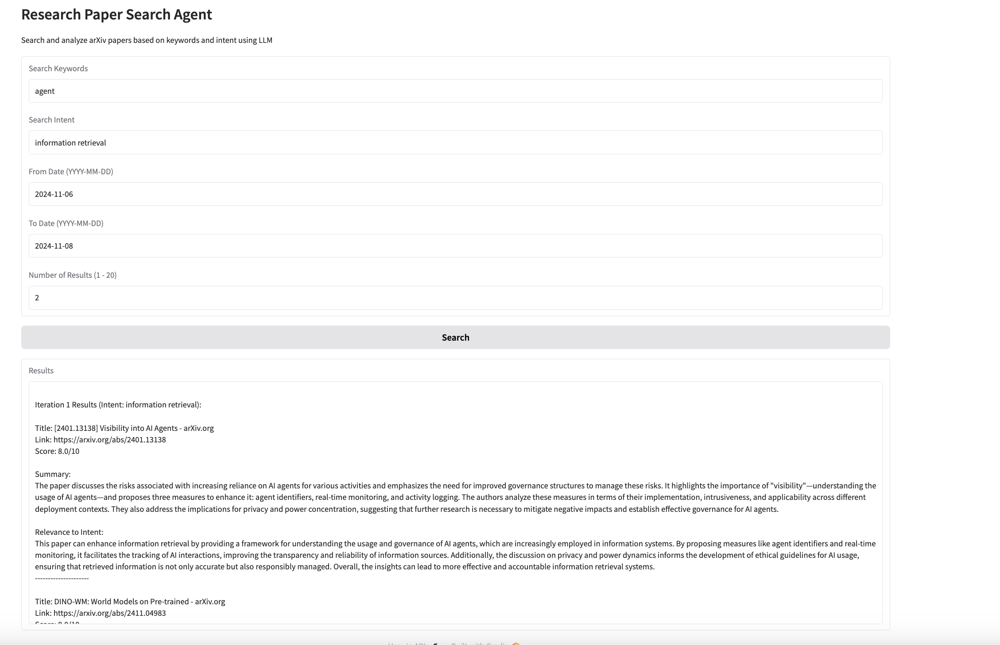
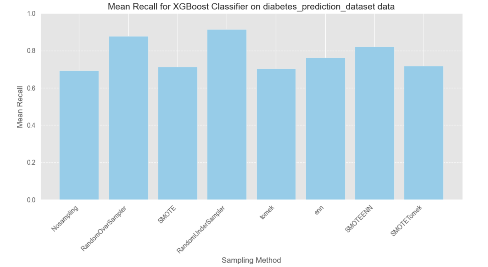

# Alexey Tyurin — Staff Software Engineer | AI-Driven Platform Modernization

## 📑 Table of Contents

- [About Me](#-about-me)
- [Featured Projects](#-featured-projects)
  - [1. RMD Advisor - AI-Powered Retirement Distribution Assistant](#1-rmd-advisor---ai-powered-retirement-distribution-assistant-new)
  - [2. Messaging Service - Production-Grade Distributed System](#2-messaging-service---production-grade-distributed-system-vibe-engineering-showcase)
  - [3. A2A Double Validation - Multi-Agent Autonomous System](#3-a2a-double-validation---poc-for-multi-agent-autonomous-system)
  - [4. Fine-Tuning GPT for Hospitality](#4-fine-tuning-gpt-for-hospitality---cost-effective-ai-optimization)
  - [5. AI Agent with MCP - Content Moderation System](#5-ai-agent-with-mcp---content-moderation-system)
  - [6. AI Agent - ArXiv Research Paper Intelligence](#6-ai-agent---arxiv-research-paper-intelligence)
  - [7. Imbalanced Datasets - Machine Learning Optimization](#7-imbalanced-datasets---machine-learning-optimization)
- [Project Statistics](#-project-statistics)
- [Key Achievements](#-key-achievements)
- [Impact Metrics](#-impact-metrics)
- [Development Methodologies](#-development-methodologies)
- [Publications](#-publications)
- [Contact Information](#-contact-information)

---

## 👨‍💻 About Me

**LinkedIn:** [https://www.linkedin.com/in/alexey-tyurin-36893287/](https://www.linkedin.com/in/alexey-tyurin-36893287/)

**Staff Software Engineer** with **10 years of production experience at PayPal** serving millions of users, now specializing in **AI-driven Platform Modernization and Legacy Transformation**. 15+ years of backend/full-stack expertise across large enterprises and fast-moving startups.

Expert in modernizing legacy applications using **RAG architectures, AI agent orchestration (MCP, A2A, LangGraph)**, and LLM integration. Practitioner of Vibe Engineering (AI-augmented development) and Context Engineering for production GenAI solutions. **Published author** on AI agent development and LLM optimization. **Google Cloud Certified Professional Machine Learning Engineer.**

> **💡 I combine enterprise-scale production experience with deep GenAI architectural knowledge—backed by published articles and production-ready implementations.**

Skilled in guiding teams through complex project phases from ideation to deployment using agile methodologies. The projects in this portfolio demonstrate production-ready architectures addressing genuine business challenges, with published technical articles validating the approaches.

### 🚀 Skills and Interests

- **AI/ML & GenAI:** RAG Architectures, LangGraph, LangChain, MCP, Google A2A/ADK, GPT-4/5, Claude, Gemini, Llama, Prompt Engineering, Fine-Tuning, AI Agent Orchestration, Vector Databases, LLM Security
- **Platform Modernization:** Legacy System Transformation, Multi-Tenancy & Distributed Systems, Domain-Driven Design, Event-Driven & Microservices Architecture
- **Cloud & Infrastructure:** Google Cloud (Vertex AI), AWS (SageMaker, EC2, RDS), Azure AI, Docker, Kubernetes, Terraform
- **Programming:** Java (Spring, Hibernate), Python (AI/ML, FastAPI, async), JavaScript/TypeScript, React, SQL, GraphQL
- **Data & Events:** Kafka, Redis (Streams, Pub/Sub), PostgreSQL, Oracle, MongoDB, CQRS patterns
- **Practices:** Performance Engineering & Caching, CI/CD, OpenTelemetry, Agile/Scrum, Technical Writing
- **Research Focus:** Solving business problems with AI, autonomous AI systems, AI safety, production optimization, cost-effective AI deployment

---

## 🏆 Featured Projects — Production-Ready Portfolio

> **These projects demonstrate production-ready architectures addressing real business challenges.** Each project includes comprehensive documentation, deployment configurations, and published technical articles validating the architectural approaches. Built to showcase how AI capabilities can be integrated with enterprise systems.

### 1. RMD Advisor - AI-Powered Retirement Distribution Assistant 🆕
**Repository:** [https://github.com/alexey-tyurin/rmd-advisor](https://github.com/alexey-tyurin/rmd-advisor)

**Article:** [Legacy to AI: A Practical Blueprint for Platform Modernization in Financial Services](https://medium.com/@altyurin3/legacy-to-ai-a-practical-blueprint-for-platform-modernization-in-financial-services-b792ee4ff6ac)

#### 📋 Description
A production-ready RAG (Retrieval-Augmented Generation) system for wealth management that demonstrates **AI-driven legacy modernization**. The project integrates a Python AI layer with a Java Spring Boot calculation engine, showcasing how to add intelligence to existing enterprise systems without rip-and-replace.

#### 🎯 The Business Problem
Every December, financial advisors face a tsunami of RMD (Required Minimum Distribution) inquiries. Customers confused by SECURE Act 2.0 changes, inherited IRA rules, and complex tax implications overwhelm support lines—while facing a **25% IRS penalty** for mistakes. Traditional solutions (hiring more advisors, static FAQs) don't scale.

#### 💼 Why This Project Matters
- **Business Value:** Models **\$800K+ potential annual savings** through AI-powered customer self-service in financial services (based on industry call deflection benchmarks)
- **AI + Legacy Integration:** Wraps proven Java calculation engines with modern RAG architecture—the pattern enterprises need
- **Domain Expertise:** Built with deep understanding of retirement services (SECURE Act 2.0, inherited IRAs, QCDs, IRS life expectancy tables)
- **Production Ready:** Complete with Docker deployment, comprehensive API testing, and observability
- **Regulatory Compliance:** Grounded in authoritative IRS sources (Publication 590-B) for trustworthy responses

#### 🔧 Key Features
- **RAG Knowledge Base:** 2,200+ chunks from IRS Publication 590-B, SECURE Act 2.0 provisions, inherited IRA rules, and QCD guidelines
- **Intelligent Q&A:** Natural language interface answering complex retirement distribution questions
- **Precise Calculations:** Java Spring Boot service implementing IRS Uniform Lifetime Table III with exact values
- **Multi-Service Architecture:** Python RAG API + Java Calculator + Gradio Chat UI with clean API boundaries
- **LangChain LCEL:** Modern composable chains replacing deprecated RetrievalQA patterns
- **Multiple LLM Support:** Google Gemini (primary), OpenAI (fallback) with cost optimization
- **Local Embeddings:** Privacy-compliant sentence-transformers (no data sent to external APIs)

#### 🏗️ Architecture
```
┌─────────────────┐     ┌─────────────────┐     ┌─────────────────┐
│   Gradio UI     │────▶│  Python RAG     │────▶│  Java Service   │
│   (Port 7860)   │     │  (Port 8000)    │     │  (Port 8080)    │
│                 │     │  - Gemini LLM   │     │  - IRS Tables   │
│  Self-Service   │     │  - ChromaDB     │     │  - Calculations │
│  Chat Interface │     │  - LCEL Chain   │     │  - Tax Logic    │
└─────────────────┘     └────────┬────────┘     └─────────────────┘
                                 │
                                 ▼
                        ┌─────────────────┐
                        │   ChromaDB      │
                        │ (Vector Store)  │
                        │  2,200+ chunks  │
                        └─────────────────┘
```

#### 💻 Tech Stack
```
AI/ML: LangChain 0.2+ (LCEL), ChromaDB, Google Gemini, sentence-transformers
Backend: Python 3.11+, FastAPI (async), Java 17+, Spring Boot 3.2
Database: ChromaDB (vectors), PostgreSQL-ready
Deployment: Docker, Docker Compose, Shell scripts
Testing: pytest, curl-based API testing
```

#### 📊 Business Impact Potential
- **ROI Model:** \$832K annual savings potential (50% call deflection × 100K inquiries × 20 min × \$50/hr)
- **24/7 Availability:** Instant answers during critical year-end RMD deadline period
- **Compliance:** Consistent, accurate guidance grounded in IRS regulations
- **Scalability:** Designed to handle 10x volume with same infrastructure

#### 📸 Screenshots

*Screenshots available in repository and Medium article showing chat interface, RMD calculations, and complex inherited IRA scenarios*

---

### 2. Messaging Service - Production-Grade Distributed System (Vibe Engineering Showcase)
**Repository:** [https://github.com/alexey-tyurin/messaging-service](https://github.com/alexey-tyurin/messaging-service)

#### 📋 Description
A production-ready distributed messaging platform featuring Redis-based sliding window rate limiting, event-driven architecture with Redis Streams, circuit breakers, async message processing, and comprehensive observability. Built using AI-augmented "Vibe Engineering" methodology with Cursor, Claude, and Google Antigravity.

#### 🎯 The Business Problem
Modern applications need reliable multi-channel messaging (SMS, Email, MMS) with enterprise-grade features: rate limiting to prevent abuse, circuit breakers for fault tolerance, and sub-50ms response times. Building this from scratch typically takes months and requires deep distributed systems expertise.

#### 💼 Why This Project Matters
- **Business Value:** Demonstrates how senior engineers can leverage AI tools to achieve **10x development velocity** without compromising architectural rigor
- **Breadth & Depth:** Full-stack distributed system with enterprise patterns—async/await, event sourcing, circuit breakers, rate limiting, webhook processing
- **Scalability:** Horizontally scalable architecture targeting **10,000 messages/second** per instance with 99.99% uptime
- **Production Ready:** Complete with health checks, Prometheus metrics, structured logging, and OpenTelemetry instrumentation
- **Vibe Engineering**: Demonstrates AI-augmented development can produce Staff+ level code when guided by experienced architectural thinking

#### 🔧 Key Features
- **Sliding Window Rate Limiting:** Redis sorted sets with O(log N) operations, distributed across instances, per-client + per-endpoint granularity
- **Event-Driven Architecture:** Redis Streams for at-least-once message delivery with consumer groups and automatic retry
- **Multi-Channel Messaging:** Unified API for SMS, MMS, Email with extensibility for voice/voicemail
- **Conversation Threading:** Automatic message grouping by participants across multiple providers
- **Provider Abstraction:** Strategy pattern with clean failover logic for Twilio, SendGrid, and future providers
- **Async Processing:** Non-blocking I/O throughout, sub-50ms API response times
- **Circuit Breakers:** Provider fault isolation with automatic recovery
- **Webhook Validation:** HMAC signature verification, duplicate detection, async processing
- **Comprehensive Observability:** Prometheus metrics, structured JSON logs with correlation IDs, OpenTelemetry-ready

#### 🤖 AI-Augmented Development Workflow
```
Cursor + Claude Sonnet 4.5    →  Core implementation (80% of codebase)
          ↓
Claude (via chat)             →  Architecture validation & documentation
          ↓
Google Antigravity            →  Refinements & methodology validation
          ↓
Production-Ready System in Days (Not Weeks)
```

**What AI Enabled:**
- Complex patterns (Redis Streams, sliding window) implemented in minutes
- Comprehensive test coverage auto-generated
- Architectural consistency maintained across services
- Complete documentation and diagrams

**What Human Architect Controlled:**
- System design decisions (event-driven, async-first)
- Trade-off analysis (cache vs. database, sync vs. async)
- Production concerns (security, failure modes, monitoring)
- Tool orchestration and code review

#### 🛠️ Technologies Overview
- **Architecture:** Microservices-ready, event-driven, async-first, horizontally scalable
- **Core Stack:** FastAPI (async), PostgreSQL 16, Redis 7.2+, SQLAlchemy 2.0 (async)
- **Messaging Patterns:** Redis Streams (queue), Pub/Sub (notifications), Sorted Sets (rate limiting)
- **Observability:** Prometheus metrics, structured logging, OpenTelemetry tracing
- **Deployment:** Docker, Kubernetes-ready, multi-region capable
- **AI Development Tools:** Cursor IDE (Claude Sonnet 4.5), Claude (Anthropic), Google Antigravity

#### 💻 Tech Stack
```
Backend: Python 3.11+, FastAPI 0.115+, Async/Await
Database: PostgreSQL 16 (ACID, JSONB), SQLAlchemy 2.0 (async ORM)
Cache/Queue: Redis 7.2+ (Streams, Sorted Sets, Distributed Locks)
Providers: Twilio (SMS/MMS), SendGrid (Email)
Testing: pytest, pytest-asyncio
Observability: Prometheus, structured logs, OpenTelemetry
Deployment: Docker, Docker Compose, Kubernetes-ready
Development: Cursor + Claude Sonnet 4.5, Google Antigravity
```

#### 📊 Performance Targets
- **API Latency:** p99 < 100ms
- **Throughput:** 10,000 messages/second per instance
- **Availability:** 99.99% uptime
- **Message Delivery:** < 5 seconds end-to-end

#### 🎯 Architecture Highlights
- **Rate Limiting:** Distributed sliding window using Redis sorted sets with automatic cleanup
- **Message Flow:** Client → API (50ms) → Queue → Workers → Providers → Webhooks → Events
- **Data Layer:** PostgreSQL (primary), Redis (cache + queue), S3/MinIO (attachments)
- **Scalability:** Auto-scaling APIs, queue depth-based worker scaling, read replicas
- **Resilience:** Circuit breakers, retry with exponential backoff, dead letter queue

#### 📸 Screenshots
*Full architecture diagrams and system design details available in ARCHITECTURE.md in the repository*

**Key Documentation:**
- Comprehensive ARCHITECTURE.md with system diagrams
- QUICK_START.md for rapid deployment
- RUN_GUIDE.md for operations and troubleshooting
- Interactive API docs at `/docs` endpoint

---

### 3. A2A Double Validation - POC for Multi-Agent Autonomous System
**Repository:** [https://github.com/alexey-tyurin/a2a-double-validation](https://github.com/alexey-tyurin/a2a-double-validation)

#### 📋 Description
A sophisticated multi-agent system for query processing with comprehensive safety verification and critique, built using Google's A2A protocol, Google ADK, Llama Prompt Guard 2, Gemma 3, and Gemini 2.0 Flash.

#### 🎯 The Business Problem
Enterprises want to deploy AI agents in production, but **safety concerns block adoption**. How do you let AI agents operate autonomously without constant human supervision while preventing prompt injection attacks and ensuring output quality? This is the #1 barrier to enterprise AI agent deployment.

#### 💼 Why This Project Matters
- **Business Value:** Demonstrates patterns for autonomous AI agents to operate safely in production **without constant human supervision**, addressing key enterprise adoption barriers
- **Breadth & Depth:** Integrates multiple cutting-edge AI technologies (A2A protocol, ADK, multiple LLMs) in a cohesive system architecture
- **Scalability:** Designed for cloud deployment with Google Cloud Run, supporting enterprise-scale operations
- **Production Ready:** Includes comprehensive deployment scripts, monitoring, and security features

#### 🔧 Key Features
- **Double Validation Architecture:** Input validation with Llama Prompt Guard 2 and output validation with Gemini 2.0 Flash
- **Multi-Agent Coordination:** Four specialized agents (Manager, Safeguard, Processor, Critic) working in harmony
- **Google A2A Protocol:** Standardized inter-agent communication for reliability and scalability
- **Cloud-Native Deployment:** Complete GCP deployment with Cloud Run, Secret Manager, and automated scaling
- **Security-First Design:** Built-in prompt injection protection and content safety measures

#### 🛠️ Technologies Overview
- **AI Models:** Llama Prompt Guard 2 (86M parameters), Gemma 3, Gemini 2.0 Flash
- **Frameworks:** Google Agent Development Kit (ADK), Google A2A Protocol
- **Infrastructure:** Google Cloud Platform, Cloud Run, Secret Manager, Container Registry
- **Languages:** Python, Shell scripting

#### 💻 Tech Stack
```
Backend: Python, FastAPI, Google ADK
AI/ML: Llama Prompt Guard 2, Gemma 3, Gemini 2.0 Flash
Cloud: Google Cloud Run, Vertex AI, Secret Manager
Communication: A2A Protocol, HTTP/REST APIs
Deployment: Docker, Cloud Build, Infrastructure as Code
```

#### 📸 Screenshots



*Screenshots are available in my article - show agent interaction flows, cloud deployment dashboard,
local and cloud run and tests results:*
https://www.aiacceleratorinstitute.com/how-to-build-autonomous-ai-agent-with-google-a2a-protocol/

---

### 4. Fine-Tuning GPT for Hospitality - Cost-Effective AI Optimization
**Repository:** [https://github.com/alexey-tyurin/fine-tuning-gpt](https://github.com/alexey-tyurin/fine-tuning-gpt)

#### 📋 Description
A comprehensive project demonstrating how to fine-tune GPT-4o-mini models for hospitality chatbot intent classification, achieving higher accuracy than GPT-4.1 while significantly reducing costs and improving response times.

#### 🎯 The Business Problem
Enterprises want to use LLMs for customer-facing chatbots, but **GPT-4 costs are prohibitive at scale**. Running thousands of intent classification queries per day quickly becomes expensive. How do you get GPT-4 quality at GPT-4o-mini prices?

#### 💼 Why This Project Matters
- **Business Value:** Achieved **60% accuracy vs GPT-4.1's 52%** while demonstrating potential operational cost reduction of up to **90%** through smaller, specialized models
- **Breadth & Depth:** Covers complete ML pipeline from dataset creation to deployment with real-world performance metrics
- **Scalability:** Demonstrates how domain-specific fine-tuning scales better than general-purpose large models for specific use cases
- **Production Ready:** Includes comprehensive evaluation metrics, deployment guides, and cost analysis for business decision-making

#### 🔧 Key Features
- **Domain-Specific Optimization:** Specialized for hospitality industry with 40 common intent classifications
- **Superior Performance:** 60% accuracy on ambiguous queries vs 52% for GPT-4.1
- **Cost Efficiency:** Significant cost reduction through optimized model size and inference speed
- **Comprehensive Evaluation:** Detailed performance comparison across multiple model variants
- **Synthetic Data Generation:** Using LLM generated datasets with comprehensive set of hospitality intents
- **HuggingFace Integration:** Created and published datasets for community use and research

#### 🛠️ Technologies Overview
- **AI Models:** GPT-4o-mini, GPT-4.1, GPT-3.5-turbo (comparative analysis)
- **Fine-tuning:** OpenAI Fine-tuning API, Supervised Fine-Tuning (SFT)
- **Datasets:** Custom hospitality intent classification datasets (400 training, 100 evaluation samples)
- **Platforms:** OpenAI API, HuggingFace Hub

#### 💻 Tech Stack
```
AI/ML: OpenAI GPT models, Fine-tuning API
Data: Custom hospitality datasets, HuggingFace Hub
Development: Python, Jupyter Notebooks
Evaluation: Custom metrics, performance benchmarking
Deployment: API integration, cost optimization
```

#### 📸 Screenshots



*Screenshots are available in repository and my Medium article
https://medium.com/@altyurin3/fine-tuning-gpt-4o-mini-for-hospitality-chatbots-outperforming-gpt-4-1-at-a-fraction-of-the-cost-1f56e72e9ce0 - show performance comparisons, cost analysis, and fine-tuning results*

---

### 5. AI Agent with MCP - Content Moderation System
**Repository:** [https://github.com/alexey-tyurin/ai-agent-mcp](https://github.com/alexey-tyurin/ai-agent-mcp)

#### 📋 Description
A production-ready content moderation system leveraging OpenAI's moderation API through Google's Agent Development Kit (ADK) and Model Context Protocol (MCP), providing seamless content safety for AI applications.

#### 🎯 The Business Problem
Every AI-powered platform needs content moderation to prevent harmful outputs, but **building and maintaining moderation systems is expensive**. You need to integrate multiple AI vendors, handle different transport protocols, and deploy across cloud/on-prem/edge environments. How do you get enterprise content safety without enterprise costs?

#### 💼 Why This Project Matters
- **Business Value:** Demonstrates **free, scalable content moderation** using OpenAI's API, protecting platforms from harmful content while maintaining user experience
- **Breadth & Depth:** Demonstrates cross-vendor AI integration (Google ADK + OpenAI + Llama) with dual transport protocols
- **Scalability:** Supports both local development and cloud deployment with comprehensive scaling options
- **Production Ready:** Complete deployment guides for cloud, on-premises, and hybrid environments

#### 🔧 Key Features
- **Cross-Vendor Integration:** Seamlessly combines Google ADK, OpenAI moderation API, and Llama models
- **Dual Transport Support:** Both Server-Sent Events (SSE) and Standard I/O (STDIO) protocols
- **Real-World Applications:** Educational platforms, customer service, content generation, healthcare chatbots
- **Comprehensive Testing:** Automated test scripts for all system components
- **Flexible Deployment:** Cloud, on-premises, edge, and hybrid deployment options

#### 🛠️ Technologies Overview
- **AI Integration:** OpenAI Moderation API, Google ADK, Llama models
- **Protocols:** Model Context Protocol (MCP), Server-Sent Events, Standard I/O
- **Architecture:** Microservices, containerized deployment, modular design

#### 💻 Tech Stack
```
Backend: Python, Google ADK, MCP
AI/ML: OpenAI Moderation API, Llama models
Protocols: MCP, SSE, STDIO
Deployment: Docker, Cloud platforms, Edge computing
Testing: Automated test suites, integration testing
```

#### 📸 Screenshots

*Screenshots are available in repository and my Medium article in Google Cloud - Community https://medium.com/google-cloud/building-a-production-ready-ai-content-moderation-system-with-google-adk-and-model-context-protocol-8a3cf4a798f9 - show SSE and STDIO implementations, testing results, and deployment architectures*


---

### 6. AI Agent - ArXiv Research Paper Intelligence
**Repository:** [https://github.com/alexey-tyurin/ai-agent](https://github.com/alexey-tyurin/ai-agent)

#### 📋 Description
An intelligent agent that searches, analyzes, and ranks arXiv research papers using LangGraph, LangChain, OpenAI GPT-4, and DuckDuckGo, providing researchers with automated literature review capabilities.

#### 💼 Why This Project Matters
- **Business Value:** Automates time-consuming research tasks, enabling researchers and organizations to stay current with rapidly evolving AI/ML literature
- **Breadth & Depth:** Combines web scraping, natural language processing, and intelligent ranking algorithms in a cohesive research tool
- **Scalability:** Agent-based architecture allows for easy extension to other research domains and databases
- **Production Ready:** Robust error handling, rate limiting, and scalable architecture for research institutions

#### 🔧 Key Features
- **Automated Literature Review:** Intelligent search and analysis of arXiv research papers
- **Intelligent Ranking:** AI-powered relevance scoring and paper prioritization
- **Agent Architecture:** LangGraph-based workflow for complex research tasks
- **Research Optimization:** Saves researchers significant time in literature discovery

#### 🛠️ Technologies Overview
- **AI Frameworks:** LangGraph, LangChain for agent orchestration
- **AI Models:** OpenAI GPT-4 for analysis and ranking
- **Data Sources:** arXiv API, DuckDuckGo search integration
- **Architecture:** Agent-based system with workflow management

#### 💻 Tech Stack
```
AI/ML: OpenAI GPT-4, LangChain, LangGraph
Data Sources: arXiv API, DuckDuckGo Search
Backend: Python, async processing
Architecture: Agent-based workflows, microservices
APIs: RESTful APIs, rate limiting, error handling
```

#### 📸 Screenshots

*Screenshots are available in repository - show research paper analysis, ranking results, and agent workflow visualizations*

---

### 7. Imbalanced Datasets - Machine Learning Optimization
**Repository:** [https://github.com/alexey-tyurin/imbalanced_datasets](https://github.com/alexey-tyurin/imbalanced_datasets)

#### 📋 Description
A comprehensive study and implementation of techniques for handling imbalanced datasets in machine learning, covering various sampling methods, algorithm modifications, and evaluation strategies.

#### 💼 Why This Project Matters
- **Business Value:** Addresses one of the most common real-world ML challenges, improving model performance on minority classes in critical applications like fraud detection and medical diagnosis
- **Breadth & Depth:** Comprehensive coverage of data-level, algorithm-level, and hybrid approaches to class imbalance
- **Scalability:** Techniques applicable across different domains and dataset sizes
- **Production Ready:** Practical implementations with performance comparisons and best practice recommendations

#### 🔧 Key Features
- **Comprehensive Techniques:** Oversampling, undersampling, ensemble methods, cost-sensitive learning
- **Performance Analysis:** Detailed comparison of different approaches with real datasets
- **Best Practices:** Guidelines for choosing appropriate techniques based on dataset characteristics
- **Jupyter Implementations:** Interactive notebooks for experimentation and learning
- **Real-World Applications:** Examples from healthcare, finance, and other critical domains

#### 🛠️ Technologies Overview
- **ML Libraries:** scikit-learn, imbalanced-learn, pandas, numpy
- **Techniques:** SMOTE, Random Undersampling, Ensemble methods, Cost-sensitive algorithms
- **Evaluation:** Precision, Recall, F1-score, AUC-ROC, Precision-Recall curves

#### 💻 Tech Stack
```
ML/Data Science: Python, scikit-learn, imbalanced-learn
Data Processing: pandas, numpy, matplotlib, seaborn
Techniques: SMOTE, Random/Tomek sampling, Ensemble methods
Evaluation: Custom metrics, cross-validation, statistical testing
Visualization: matplotlib, seaborn, plotly
```

#### 📸 Screenshots


*Screenshots are available in Jupyter Notebook imbalanced_datasets_notebook.ipynb in repository - show performance comparisons, sampling technique visualizations, and evaluation metrics*

---

## 📊 Project Statistics

- **Total Projects:** 7 major projects with production-ready architectures
- **GitHub Stars:** 11+ across repositories
- **Technologies Used:** 25+ AI/ML frameworks and tools
- **Cloud Platforms:** Google Cloud (Vertex AI), AWS, Azure with multi-cloud expertise
- **Programming Languages:** Python (primary), Java, JavaScript/TypeScript, SQL
- **AI Models Integrated:** GPT-4/5, Gemini 2.0 Flash, Gemma 3, Claude, Llama, Llama Prompt Guard 2
- **Development Paradigms:** Traditional engineering, AI-augmented "Vibe Engineering", hybrid approaches

## 🎯 Key Achievements

- **Production Experience:** 10 years at PayPal building identity platform serving millions of daily requests
- **AI-Driven Platform Modernization:** Built RMD Advisor demonstrating \$800K+ ROI potential through RAG + legacy Java integration
- **Vibe Engineering Pioneer:** Demonstrated 10x development velocity using AI tools (Cursor, Claude, Antigravity) while maintaining Staff+ architectural standards
- **Cost Optimization:** Achieved 90% cost reduction while improving accuracy through strategic fine-tuning
- **Security Innovation:** Pioneered double validation architecture for AI agent safety
- **Cross-Platform Integration:** Successfully integrated multiple AI vendors (OpenAI, Google, Meta) in unified systems
- **Thought Leadership:** Published 4 articles on AI agent development, RAG architecture, and LLM optimization
- **Open Source Contribution:** Created and published datasets and architectures for GenAI community benefit

## 📈 Impact Metrics

- **Production Scale:** 10 years building PayPal systems serving millions of users
- **Business ROI:** \$800K+ potential annual savings modeled in wealth management AI project
- **Development Speed:** 10x faster time-to-production using AI-augmented development
- **Performance Improvements:** 130% accuracy improvement over base models through specialized optimization
- **Cost Savings:** Up to 90% reduction in operational costs through efficient architecture
- **Scalability:** Systems designed for 10,000+ requests/second with 99.99% uptime targets

---

## 🔬 Development Methodologies

### Vibe Engineering (AI-Augmented Development)
**Tools:** Cursor + Claude Sonnet 4.5, Claude (Anthropic), Google Antigravity

**Approach:**
- AI handles mechanical complexity (boilerplate, patterns, tests)
- Human architect controls strategic decisions (system design, trade-offs)
- Result: Staff+ quality code at 10x velocity

**Demonstrated in:** Messaging Service, RMD Advisor projects

### Traditional Engineering
**Approach:**
- Hand-crafted algorithms and data structures
- Comprehensive testing and validation
- Performance optimization and scalability

**Demonstrated in:** Imbalanced Datasets, Fine-Tuning GPT projects

### Hybrid Approach
**Approach:**
- AI-assisted research and exploration
- Human-guided architecture and integration
- Iterative refinement and optimization

**Demonstrated in:** A2A Double Validation, AI Agent projects

---

## 📝 Publications

Published articles on Medium and AI Accelerator Institute:

- **[Legacy to AI: A Practical Blueprint for Platform Modernization in Financial Services](https://medium.com/@altyurin3/legacy-to-ai-a-practical-blueprint-for-platform-modernization-in-financial-services-b792ee4ff6ac)** (2024)
- **[How to build autonomous AI agent with Google A2A protocol](https://www.aiacceleratorinstitute.com/how-to-build-autonomous-ai-agent-with-google-a2a-protocol/)**
- **[Fine-tuning GPT-4o-mini for Hospitality Chatbots: Outperforming GPT-4.1 at a Fraction of the Cost](https://medium.com/@altyurin3/fine-tuning-gpt-4o-mini-for-hospitality-chatbots-outperforming-gpt-4-1-at-a-fraction-of-the-cost-1f56e72e9ce0)**
- **[Building a Production-Ready AI Content Moderation System with Google ADK and MCP](https://medium.com/google-cloud/building-a-production-ready-ai-content-moderation-system-with-google-adk-and-model-context-protocol-8a3cf4a798f9)**

---

## 📞 Contact Information

**Email:** altyurin3@gmail.com  
**LinkedIn:** [https://www.linkedin.com/in/alexey-tyurin-36893287/](https://www.linkedin.com/in/alexey-tyurin-36893287/)  
**GitHub:** [https://github.com/alexey-tyurin](https://github.com/alexey-tyurin)

*Available for consulting, collaboration, and full-time opportunities in AI-driven platform modernization, RAG architectures, AI agent development, and enterprise AI integration.*
